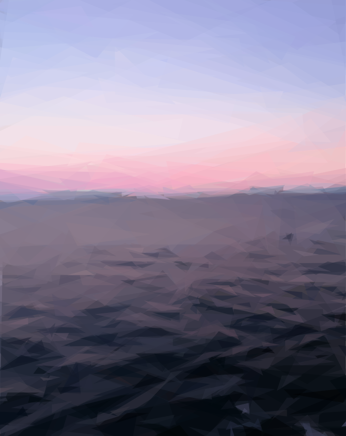

# sqipify

[](https://travis-ci.com/ltetzlaff/sqipify)

[](https://github.com/prettier/prettier)

## Demo

Generate SVG Placeholders for Images using [SQIP](https://github.com/technopagan/sqip) based on [Primitive](https://github.com/fogleman/primitive).

### Reference Image


700x882, 24 bit, 58.3 KB

### Parameters

| *blur* | numberOfPrimitives = 10 | numberOfPrimitives = 50 | numberOfPrimitives = 100 | numberOfPrimitives = 500 |
|--------|-----------------------------------------------|------------------------------------------------|-------------------------------------------------|--------------------------------------------------|
| 0      |  859 B    |  3.50 KB   |  6.59 KB   |  37.52 KB   |
| 5      |  913 B    |  3.9 KB   |  6.48 KB   |  37.93 KB   |
| 10     |  1019 B  |  3.58 KB  |  6.61 KB  |  38.13 KB  |
| 25     |  995 B   |  3.48 KB  |  6.42 KB  |  37.88 KB  |
| 100    |  1010 B |  3.72 KB |  6.73 KB |  38.01 KB |

### Only Triangles

| *blur* | numberOfPrimitives = 10 | numberOfPrimitives = 50 | numberOfPrimitives = 100 | numberOfPrimitives = 500 |
|--------|--------------------------------------------|----------------------------------------------|-----------------------------------------------|------------------------------------------------|
| 0      |  714 B |  3.04 KB |  5.83 KB |  28.32 KB |
| 5      |  797 B |  3.09 KB |  5.98 KB |  28.17 KB |
| 10     |  783 B |  3.07  KB |  5.92 KB |  28.21 KB |

### Only Rectangles

| *blur* | numberOfPrimitives = 10 | numberOfPrimitives = 50 | numberOfPrimitives = 100 | numberOfPrimitives = 500 |
|--------|--------------------------------------------|----------------------------------------------|-----------------------------------------------|------------------------------------------------|
| 0      |  647 B |  2.72 KB |  5.30 KB |  25.95 KB |
| 5      |  719 B |  2.77 KB |  5.38 KB |  26.06 KB |
| 10     |  719 B |  2.80 KB |  5.41 KB |  26.02 KB |

## Use

```ts
import sqipify from "sqipify"
const { input, output } = await sqipify("norway.jpg", numberOfPrimitives, blur, mode)
```

## Setup (in ./)

### Install NodeJS

[Download](https://nodejs.org/en/download/current/)

### Fetch dependencies

```bash
npm install
```

## Dev (in ./)

Typescript builds are automatic and watch for file changes:
```bash
npm run build
```

or run this to build only once:
```bash
npm run buildOnce
```

Building, Linting, Formatting, Testing:
```bash
npm test
```

## Contribution

- use `git pull --rebase` in favor of regular pull, i recommend configuring it globally via:
  ```bash
  git config --global pull.rebase true
  ```
